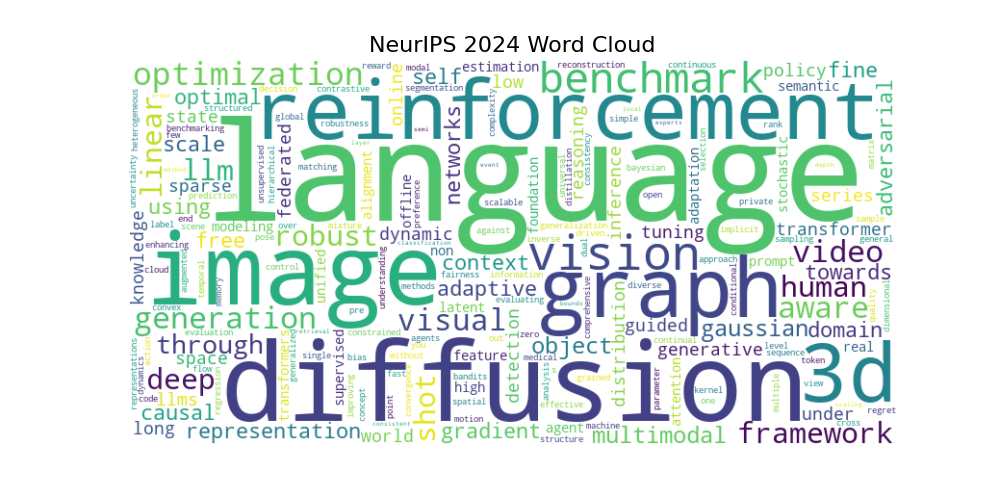
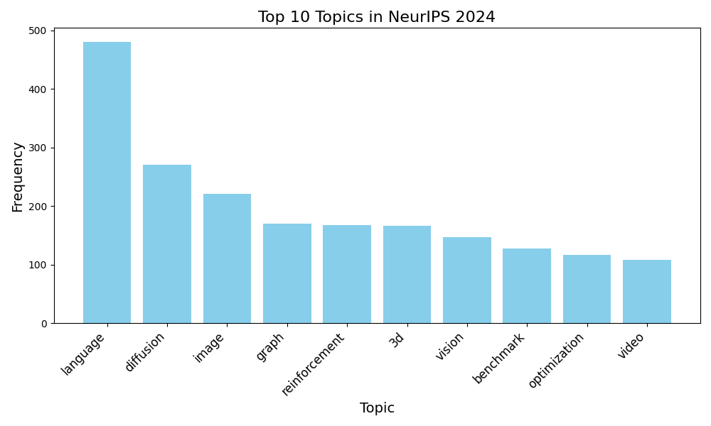
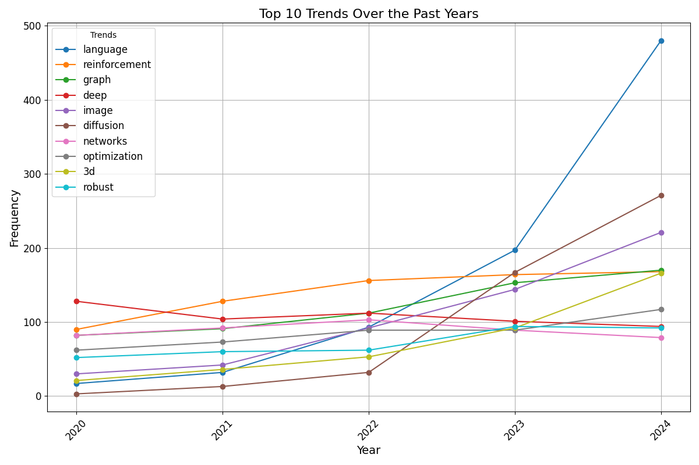
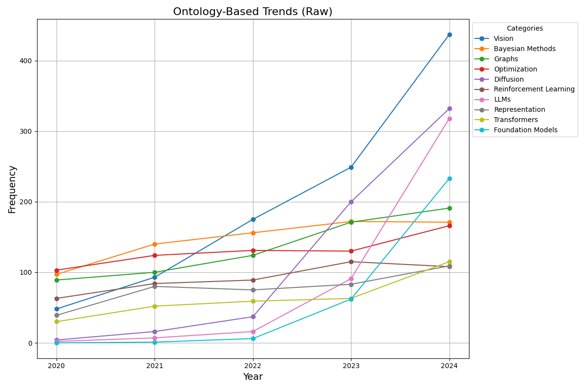
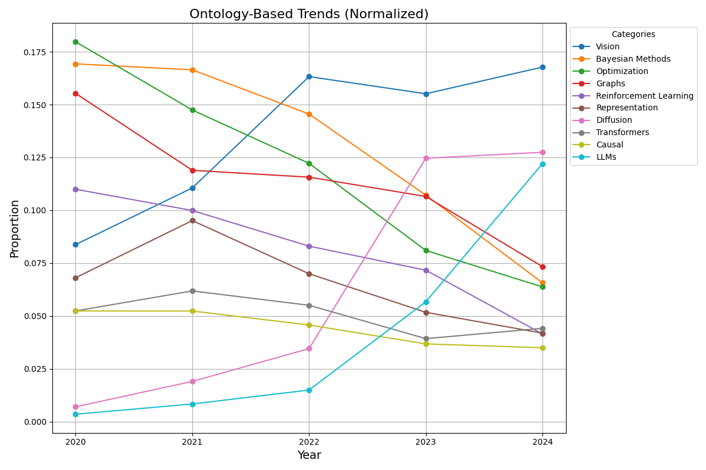
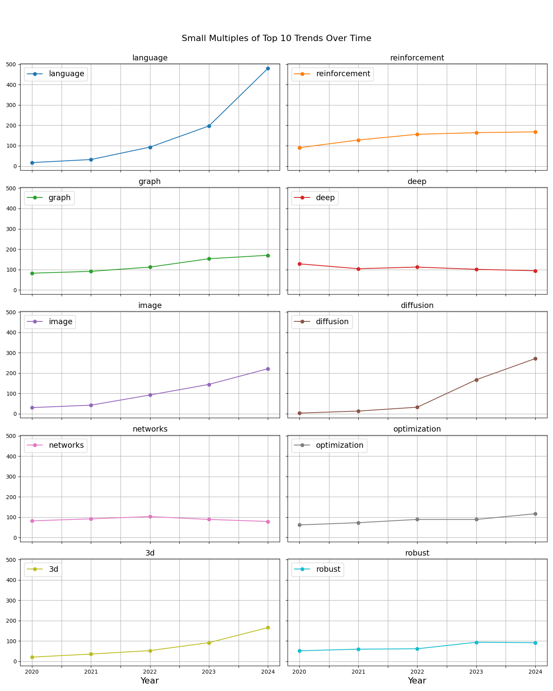

# NeurIPS 2024 AI Research Trends

## Overview
This repository analyzes **NeurIPS papers (2020-2024)** to uncover key trends, research directions, and emerging areas in Artificial Intelligence (AI). Using extracted titles, advanced natural language processing (NLP), and ontology-based categorization, we visualize trends in AI research topics across multiple years.

---

## Key Insights

### 1. Word Cloud of NeurIPS 2024
The word cloud below highlights prominent keywords from the 2024 NeurIPS conference, emphasizing key research areas:  

- **Language Models** (LLMs, Transformers)  
- **Diffusion Models** (e.g., Stable Diffusion)  
- **Reinforcement Learning**  
- **Graph Neural Networks**  
- Emerging topics such as **3D Vision**, **Optimization**, and **Causal Inference**.  



---

### 2. Top Research Topics (2020-2024)
The bar charts illustrate the **top 10 topics** for each year, showing which areas have consistently dominated or emerged in AI research.

| **Year** | **Key Trends** |
| -------- | -------------- |
| **2020** | Deep Learning, Reinforcement, Optimization |
| **2021** | Reinforcement Learning, Deep Networks, Optimization |
| **2022** | Reinforcement Learning, Graph Methods, Language Models |
| **2023** | **Language Models** (LLMs), **Diffusion Models**, Vision |
| **2024** | **Language Models** lead, followed by **Diffusion**, Vision, and 3D topics |

**Example: Top Topics in 2024**  


---

### 3. Trends Over Time
The line plot below showcases how the **top 10 AI research trends** evolved from 2020 to 2024:  

- **Language Models** have shown **exponential growth** since 2023.  
- **Diffusion Models** emerged as a prominent topic starting in 2023.  
- Topics such as **3D Vision**, **Optimization**, and **Graph Methods** remained consistent but with varying intensity.  



---

### 4. Ontology-Based Trends
Research topics were grouped into broader **ontological categories** (e.g., **Vision**, **Transformers**, **Optimization**, **Bayesian Methods**, etc.). Below are the insights:  

#### Raw Frequencies
The raw frequency analysis highlights **Vision**, **Diffusion**, and **Reinforcement Learning** as dominant themes.



#### Normalized Trends
The normalized plot identifies emerging areas such as **Diffusion Models** and **Foundation Models (LLMs)** while showing a decline in older topics like **Optimization**.



---

### 5. Small Multiples Visualization
The figure below provides a **small multiples plot** for the top 10 topics over time, allowing a more granular view of individual trends.



---

## Conclusion
The analysis reveals a clear **shift in AI research** towards generative models, particularly **LLMs** and **Diffusion Models**. At the same time, areas like **Graph Neural Networks** and **Reinforcement Learning** continue to remain active. Ontology-based insights further showcase a diversification of AI applications into fields like **Healthcare AI**, **Climate AI**, and **AI4Materials**.

Future research directions are likely to focus on scaling **LLMs**, improving **multi-modal learning**, and exploring **causality** in AI systems.

---

## Repository Contents

- **Data**: Extracted titles of NeurIPS papers (2020-2024).  
- **Figures**: Visualizations, including word clouds, bar charts, and line plots.  
- **Code**: Python scripts for title extraction, NLP analysis, and trend visualization.  

---

## How to Use

1. Clone this repository:  
   ```bash
   git clone https://github.com/your-username/NeurIPS2024AIResearchTrends.git
   cd NeurIPS2024AIResearchTrends
   ```
   
2. Run the Jupyter Notebook for detailed analysis and visualizations.
  ```bash
   jupyter notebook neurips_trends_analysis.ipynb
  ```

3. Explore the figures folder for generated visualizations.
