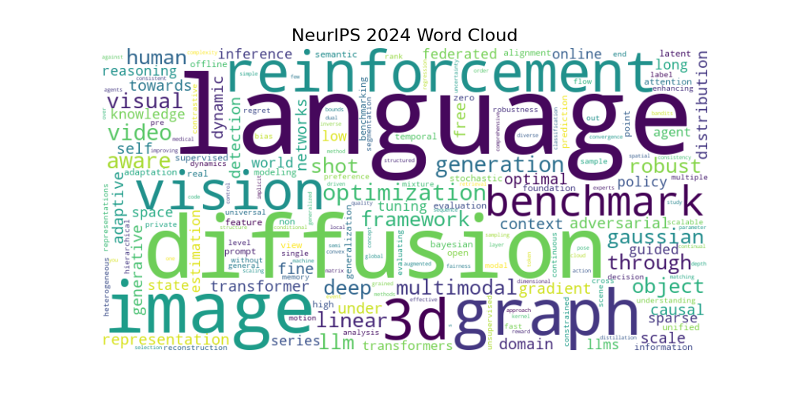

# NeurIPS 2024 AI Research Trends
By Shayan Mousavi, PhD

## Overview
This repository analyzes **NeurIPS papers (2020-2024)** to uncover key trends, research directions, and emerging areas in Artificial Intelligence (AI). Using extracted titles, advanced natural language processing (NLP), and ontology-based categorization, we visualize trends in AI research topics across multiple years.

---

## Key Insights

### Word Cloud of NeurIPS 2024

The **2024 word cloud** highlights the most prominent words and phrases, emphasizing key research areas using word frequency:

- **Language Models** (LLMs, Transformers)
- **Diffusion Models**
- **Vision and Graph Neural Networks**
- Emerging topics such as **3D Vision**, **Optimization**, and **Video Processing**


---

### Research Topic Analysis

We analyzed top topics from NeurIPS papers in two ways:
1. **Word Frequency Analysis**: Direct frequency of words in paper titles.
2. **Ontological Analysis**: Grouping words into broader research categories.

#### Word Frequency Analysis

The bar charts illustrate the **top topics** for each year, showing which areas have consistently dominated or emerged in AI research.

| **Year** | **Key Trends** |
| -------- | -------------- |
| **2024** | **Language Models** lead, followed by **Diffusion**, Vision, and 3D rendering topics |
| **2023** | **Language Models** (LLMs), **Diffusion Models**, Vision |
| **2022** | Reinforcement Learning, Graph Methods, Language Models |
| **2021** | Reinforcement Learning, Deep Networks, Optimization |
| **2020** | Deep Learning, Reinforcement, Optimization |

Example bar chart for 2024:


More plots can be found in the **Jupyter Notebook** or the **figures folder** in the repository:  
- [Jupyter Notebook](https://github.com/shmouses/NeurIPS2024AITrends/blob/main/NeurIPS2024_AI_Trends_Analysis.ipynb)  
- [Figures Folder](https://github.com/shmouses/NeurIPS2024AITrends/tree/main/figures)

---

#### Trends Over Time
The line plot below showcases how the **top 10 AI research trends** evolved from 2020 to 2024:  

- **Language Models** have shown **exponential growth** since 2023.  
- **Diffusion Models** emerged as a prominent topic starting in 2023.  
- Topics such as **3D Vision**, **Optimization**, and **Graph Methods** remained consistent but with varying intensity.  


---

### Ontology-Based Trends

Ontology groups related terms into broader **research categories** (e.g., "Language Models" includes LLMs, GPT, and Transformers). This approach helps uncover high-level trends and allows better understanding of the **direction and diversity** of research topics. Ontologies consolidate variations of terms under unified themes and highlight trends that are not visible through raw word frequencies.

#### Top Ontological Categories by Year

The table below shows the **top 5 ontological categories** for each year, chosen because ontologies encompass a wider range of topics and concepts.

| **Year** | **Top Ontological Categories** |
| -------- | ------------------------------ |
| **2024** | Vision, Diffusion, LLMs, Foundation Models, Graphs |
| **2023** | Vision, Diffusion, Bayesian Methods, Graphs, Optimization |
| **2022** | Vision, Bayesian Methods, Optimization, Graphs, Reinforcement Learning |
| **2021** | Bayesian Methods, Optimization, Graphs, Vision, Reinforcement Learning |
| **2020** | Optimization, Bayesian Methods, Graphs, Reinforcement Learning, Vision |

#### Ontology-Based Bar Plots

The bar charts below highlight the **top ontological categories** for selected years, demonstrating the trend:

#### 2024 Ontological Categories


#### 2023 Ontological Categories


#### 2022 Ontological Categories


Additional plots are available in the **figures folder** and the **Jupyter Notebook**:  
- [Jupyter Notebook](https://github.com/shmouses/NeurIPS2024AITrends/blob/main/NeurIPS2024_AI_Trends_Analysis.ipynb)  
- [Figures Folder](https://github.com/shmouses/NeurIPS2024AITrends/tree/main/figures)

---

#### Raw Frequencies
The raw frequency analysis highlights **Vision**, **Diffusion**, and **Reinforcement Learning** as dominant themes.


##### Small Multiples Visualization
The figure below provides a **small multiples plot** for the top 10 topics over time, allowing a more granular view of individual trends.


#### Normalized Trends
The normalized plot identifies emerging areas such as **Diffusion Models** and **Foundation Models (LLMs)** while showing a decline in older topics like **Optimization** and **Bayesian Methods**.


##### Small Multiples Visualization
The figure below provides a **small multiples plot** for the top 10 topics over time, allowing a more granular view of individual trends.


---

## Conclusion
The analysis reveals a clear **shift in AI research** towards generative models, particularly **LLMs** and **Diffusion Models**. At the same time, areas like **Graph Neural Networks** and **Reinforcement Learning** continue to remain active. Ontology-based insights further showcase a diversification of AI applications into fields like **Healthcare AI**, **Climate AI**, **AI4Chemistry**, **AI4Physics** and **AI4Materials**.

Future research directions are likely to focus on scaling **LLMs**, improving **multi-modal learning**, and exploring **causality** in AI systems.

---

## Repository Contents

- **Data**: Extracted titles of NeurIPS papers (2020-2024).  
- **Figures**: Visualizations, including word clouds, bar charts, and line plots.  
- **Code**: Python scripts for title extraction, NLP analysis, and trend visualization.  

---

## How to Use

1. Clone this repository:  
   ```bash
   git clone https://github.com/your-username/NeurIPS2024AIResearchTrends.git
   cd NeurIPS2024AIResearchTrends
   ```
   
2. Run the Jupyter Notebook for detailed analysis and visualizations.
  ```bash
   jupyter notebook neurips_trends_analysis.ipynb
  ```

3. Explore the figures folder for generated visualizations.


---

## Contact Information  
**Shayan Mousavi, PhD**  
- **GitHub**: [shmouses](https://github.com/shmouses)  
- **LinkedIn**: [Shayan Mousavi M.](https://www.linkedin.com/](https://www.linkedin.com/in/shayan-mousavi-ai/))    
